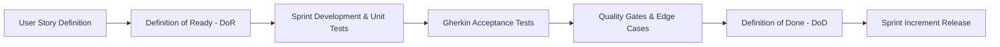
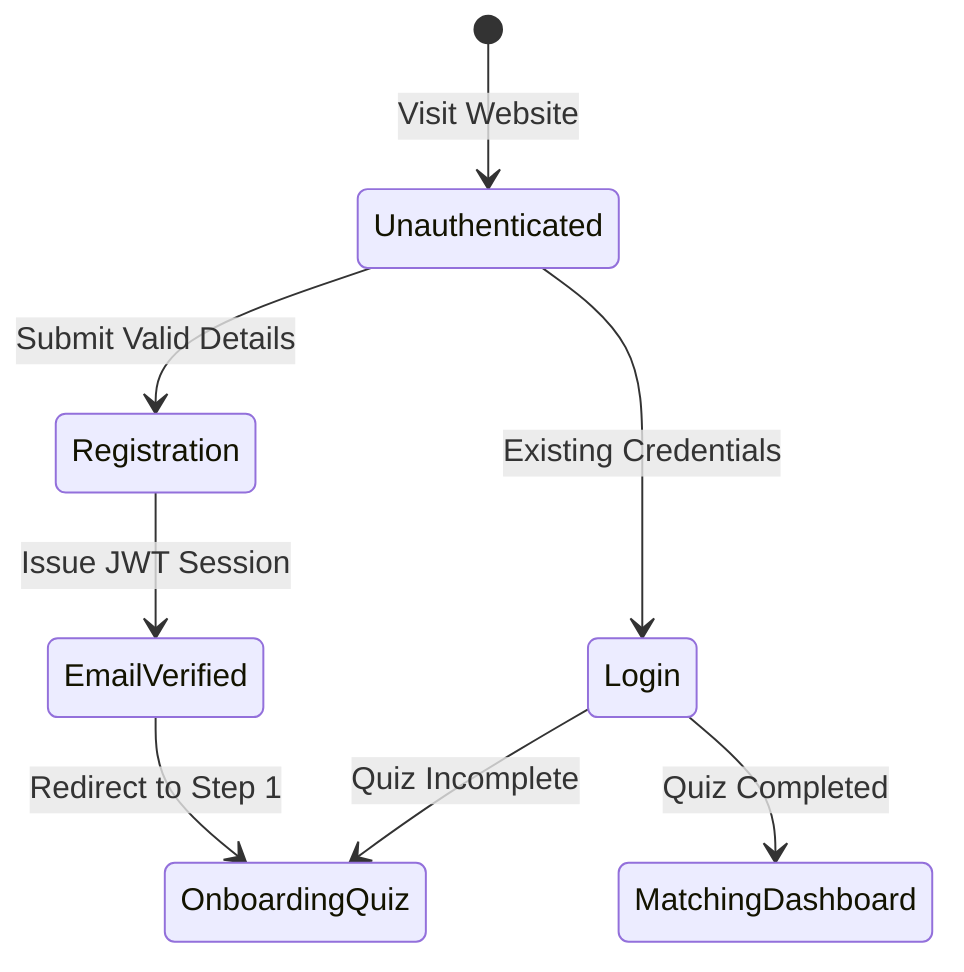
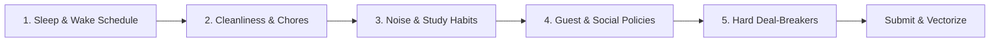
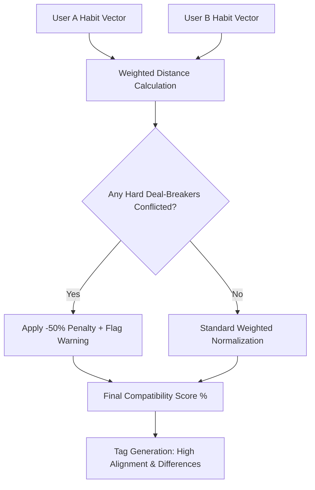
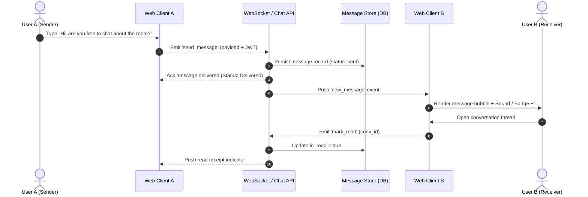

# Acceptance Criteria & Quality Gates Specification
## Behavior-Based Roommate Matching Web App

---

## Document Control

| Attribute | Details |
| :--- | :--- |
| **Project Title** | Behavior-Based Roommate Matching Web App |
| **Course** | 192-304 Agile Software Development (BSc IT - Year 3) |
| **Document Type** | Agile Acceptance Criteria & Test Validation Specification |
| **Version** | 1.0.0 |
| **Status** | Approved / Sprint Baseline |
| **Methodology** | Behavior-Driven Development (BDD) & Agile Quality Assurance |

---

## 1. Quality Framework & Principles



### 1.1 Definition of Ready (DoR)
A User Story is ready for sprint backlog inclusion only when:
1. Written in standard Agile format: *As a [role], I want [capability], so that [business value]*.
2. Acceptance Criteria are defined in **Given-When-Then (Gherkin)** format.
3. Dependencies and UI wireframe references are identified.
4. Estimated by the development team using Story Points (Planning Poker).

### 1.2 Definition of Done (DoD)
A User Story is considered **Done** and ready for demo only when:
1. All Gherkin acceptance criteria scenarios pass without errors.
2. Code passes linting (`ESLint` / `Prettier`) and type checks with zero errors.
3. Unit test coverage reaches $\ge 80\%$ for business logic and algorithms.
4. Peer review completed via Pull Request with at least one approval.
5. Responsive layout verified on mobile ($360\text{px}$), tablet ($768\text{px}$), and desktop ($1280\text{px}+$).
6. Verified against security guidelines (OWASP Top 10, no raw habit data exposed).

---

## 2. Epic 1: Authentication & User Onboarding



---

### User Story `US-1.1`: User Registration with Email & Password
> **As a** new student or renter,  
> **I want to** register for an account using my email and password,  
> **So that** I can create a private profile and take the roommate matching assessment.

#### Scenario 1.1.1: Successful New Account Registration (Happy Path)
```gherkin
Given the user is on the "/register" page
When the user enters a valid email "student@university.edu"
And enters a full name "Alex Morgan"
And enters a secure password "SecurePass123!"
And clicks the "Create Account" button
Then the system creates a new user record in the database
And hashes the password using bcrypt with a salt factor of >= 10
And returns a 201 Created HTTP status code with a JWT session token
And navigates the user directly to the Lifestyle Quiz onboarding page ("/quiz")
```

#### Scenario 1.1.2: Duplicate Email Rejection
```gherkin
Given a user account already exists for "alex@university.edu"
When a new user attempts to register with "alex@university.edu"
And clicks the "Create Account" button
Then the system returns a 409 Conflict HTTP status
And displays an inline error: "An account with this email already exists. Please log in."
And no new database record is created.
```

#### Scenario 1.1.3: Password Complexity Validation Failure
```gherkin
Given the user is filling out the registration form
When the user enters a password with less than 8 characters (e.g. "pass")
Then the "Create Account" button remains disabled or triggers validation on click
And an error message is displayed: "Password must be at least 8 characters long and include numbers/symbols."
```

---

### User Story `US-1.2`: User Authentication & Session Persistence
> **As a** returning user,  
> **I want to** securely log in to my account,  
> **So that** I can resume browsing matches and responding to chat messages.

#### Scenario 1.2.1: Valid Login with Route Redirection
```gherkin
Given an existing registered user with email "alex@university.edu" and password "SecurePass123!"
When the user submits these credentials on the "/login" page
Then the backend returns an HTTP-only JWT auth cookie or Bearer token
And if the user has already completed the lifestyle quiz:
  Then the system redirects to "/matches" (Matching Directory)
And if the user has NOT completed the lifestyle quiz:
  Then the system redirects to "/quiz" (Habit Assessment)
```

#### Scenario 1.2.2: Invalid Credentials Handling
```gherkin
Given the user is on the "/login" page
When the user submits an incorrect password or unregistered email
Then the system returns a 401 Unauthorized status
And displays a generic error: "Invalid email or password. Please try again."
And clears the password input field without revealing whether the email exists.
```

---

### User Story `US-1.3`: Profile & Housing Preference Configuration
> **As a** user,  
> **I want to** define my housing role, budget range, and preferred location,  
> **So that** search filters can accurately match my logistical needs.

#### Scenario 1.3.1: Profile Setup with Valid Logistical Bounds
```gherkin
Given an authenticated user on the "/profile/setup" page
When the user selects role "Room Seeker"
And sets budget range Min: "$400" and Max: "$700"
And selects target location "Downtown / Campus North"
And sets target move-in date "2026-10-01"
And clicks "Save Profile"
Then the profile details are saved to the database
And the system confirms with a toast notification: "Profile updated successfully."
```

#### Scenario 1.3.2: Invalid Budget Range Boundary Check
```gherkin
Given the user is configuring budget filters
When the user enters a Min Budget "$800" that is greater than the Max Budget "$500"
Then the form shows a validation error: "Minimum budget cannot exceed maximum budget."
And prevents form submission until corrected.
```

---

## 3. Epic 2: Habit & Lifestyle Assessment Quiz



---

### User Story `US-2.1`: Rapid 2-Minute Lifestyle Questionnaire
> **As a** busy student or renter,  
> **I want to** complete a structured, multi-step habit assessment,  
> **So that** the system can evaluate my lifestyle without requiring me to write essays.

#### Acceptance Criteria & Rule Table:

| Step | Dimension | Input Type | Allowed Values & Weights |
| :---: | :--- | :--- | :--- |
| **1** | **Sleep Cycle** | Radio Selection | `1: Early Bird (22:00-06:00)`, `2: Balanced (00:00-08:00)`, `3: Night Owl (02:00-10:00)` |
| **2** | **Cleanliness Standards** | Radio Selection | `1: Daily Spotless`, `2: Standard / Tidy`, `3: Relaxed / Weekend Chores` |
| **3** | **Noise Tolerance** | Radio Selection | `1: Pure Silence Required`, `2: Moderate Noise OK`, `3: High Noise / Music OK` |
| **4** | **Guest Policy** | Radio Selection | `1: No Overnight Guests`, `2: Occasional Weekends`, `3: Frequent Social Guests` |
| **5** | **Deal-Breaker Constraints** | Multi-Checkbox | `Strictly Non-Smoking`, `No Pets Allowed`, `Quiet Hours Enforced After 23:00` |

#### Scenario 2.1.1: Complete Quiz Submission (Under 2 Minutes)
```gherkin
Given an authenticated user on "/quiz"
When the user completes steps 1 through 5 in order
And clicks "Finish & Find Roommates"
Then the backend converts the answers into a normalized numerical habit vector:
  | sleep_cycle | clean_level | noise_level | guest_policy | non_negotiables |
  | 3           | 2           | 1           | 2            | ["non_smoking"] |
And saves the vector to the `HABIT_PROFILES` table within < 500ms
And immediately recalculates match percentages for the user
And redirects to the "/matches" directory with personalized results.
```

#### Scenario 2.1.2: Progress Preservation on Step Navigation
```gherkin
Given the user is on Step 3 of the quiz
When the user clicks the "Previous" button to review Step 2
Then the user's previous selection on Step 2 remains selected
And clicking "Next" returns to Step 3 without data loss.
```

---

## 4. Epic 3: Behavioral Compatibility & Matching Engine



---

### User Story `US-3.1`: Algorithmic Compatibility Score Calculation
> **As a** user searching for compatible housemates,  
> **I want** the system to compute a mathematically accurate compatibility percentage,  
> **So that** I can rank candidate profiles by true lifestyle harmony.

#### Mathematical Quality Formula:
$$S_{total}(A, B) = \max\left(0\%, \left[ 0.30 \cdot S_{sleep} + 0.25 \cdot S_{clean} + 0.25 \cdot S_{guest} + 0.20 \cdot S_{noise} \right] - \text{Penalty}_{dealbreakers}\right)$$

Where category similarity is:
$$S_{dim}(A, B) = 1 - \frac{|A_{dim} - B_{dim}|}{\text{MaxDistance}_{dim}}$$

#### Scenario 3.1.1: High Compatibility Verification ($\ge 90\%$)
```gherkin
Given User A has habit vector: [Sleep: 2, Clean: 2, Guest: 2, Noise: 2]
And User B has identical habit vector: [Sleep: 2, Clean: 2, Guest: 2, Noise: 2]
When the matching engine computes their compatibility score
Then the overall score returned is exactly 100%
And the UI displays a green badge: "100% Match - Exceptional Lifestyle Harmony".
```

#### Scenario 3.1.2: Divergent Lifestyle Calculation
```gherkin
Given User A is an Early Bird [Sleep: 1] and Deep Cleaner [Clean: 1]
And User B is a Night Owl [Sleep: 3] and Relaxed Cleaner [Clean: 3]
When the matching engine computes their category scores
Then Sleep similarity is 0.0 (30% weight lost)
And Clean similarity is 0.0 (25% weight lost)
And the calculated match score cannot exceed 45%.
```

---

### User Story `US-3.2`: Hard Deal-Breaker Penalty Enforcement
> **As a** tenant with strict non-negotiable living rules,  
> **I want** candidates who violate my deal-breakers to be flagged or heavily penalized,  
> **So that** I don't accidentally sign a lease with an incompatible person.

#### Scenario 3.2.1: Severe Deal-Breaker Conflict Penalty
```gherkin
Given User A specifies "Strictly Non-Smoking" as a non-negotiable hard rule
And User B has marked "Smoker / Indoor Vaping: True"
When the matching engine runs between User A and User B
Then the system deducts a 50% penalty from the base score
And the profile card displays an amber/red warning tag: "⚠️ Rule Mismatch: Non-Smoking Policy"
And the overall score is clamped between 0% and 50%.
```

---

## 5. Epic 4: Filtered Roommate & Room Directory

---

### User Story `US-4.1`: Multi-Criteria Search & Dynamic Filtering
> **As a** room seeker,  
> **I want to** filter candidate profiles by budget, location, and minimum match %,  
> **So that** I only see candidates who fit my financial and personal criteria.

#### Acceptance Criteria Table:

| Filter Attribute | Control Type | Validation / Behavior |
| :--- | :--- | :--- |
| **Minimum Match %** | Slider ($50\% - 95\%$) | Filters out all candidates with `overall_score < slider_value`. |
| **Budget Range** | Dual Handle Range Slider | Retains profiles where `candidate.budget_min <= user.max` and `candidate.budget_max >= user.min`. |
| **Location** | Dropdown / Multi-Select | Matches user target zone (e.g., Campus South, City Center). |
| **Role Type** | Segmented Tab | Options: "All", "Has a Room", "Looking for a Room". |

#### Scenario 4.1.1: Filtering by Minimum 80% Compatibility
```gherkin
Given the directory contains 15 candidate profiles with scores ranging from 45% to 95%
When the user drags the "Minimum Compatibility" filter slider to "80%"
Then the directory dynamically updates within < 300ms without full page reload
And only profiles with a match score of >= 80% are visible (e.g. 5 profiles)
And an active filter counter displays: "Showing 5 compatible matches".
```

#### Scenario 4.1.2: Zero-Match Empty State Fallback
```gherkin
Given the user applies a combination of strict filters (Budget < $200, Match >= 95%)
When no candidate profiles satisfy all filter conditions
Then the system displays a clear empty state:
  "No roommates found matching these exact criteria."
And presents a button: "Reset Filters" or "Lower Minimum Compatibility".
```

---

### User Story `US-4.2`: Candidate Profile Detail View
> **As a** user browsing candidates,  
> **I want to** open an expanded profile card,  
> **So that** I can inspect lifestyle breakdown charts, bio, budget, and move-in timeline.

#### Scenario 4.2.1: Profile Card Expanded View
```gherkin
Given the user is on the directory page
When the user clicks on candidate "Jordan Taylor (88% Match)"
Then a modal or detail page opens displaying:
  * Profile avatar, verification status, and university/major.
  * Compatibility breakdown bar (Sleep: 90%, Cleaning: 85%, Guests: 90%).
  * Weekly Routine comparison table (Quiet Hours: 23:00 - 07:00).
  * Direct CTA button: "Send Message".
```

---

## 6. Epic 5: 1-on-1 Direct Messaging & Communication



---

### User Story `US-5.1`: Real-Time Direct Message Exchange
> **As a** matched roommate candidate,  
> **I want to** send instant messages to another user within the app,  
> **So that** we can discuss living arrangements without disclosing private contact info immediately.

#### Scenario 5.1.1: Instant In-App Message Delivery (Active State)
```gherkin
Given User A and User B have an active match thread
And both users currently have the chat window open
When User A types "Hello! I saw our 92% match score. Is the room still available?" and hits Send
Then the message is saved to the database with a server timestamp
And transmitted via WebSocket to User B's screen in < 300ms
And User A's client renders a single checkmark ("Delivered").
```

#### Scenario 5.1.2: Offline / Inactive User Message Notification
```gherkin
Given User B is logged in but browsing the Directory page (chat window closed)
When User A sends a direct message to User B
Then the navigation bar chat icon on User B's screen displays an unread counter badge (+1)
And clicking the badge opens the conversation with the unread message highlighted.
```

#### Scenario 5.1.3: Empty Input & Spam Guard
```gherkin
Given User A has the chat window open
When User A presses Send while the text input is empty or contains only whitespace
Then the send button does not trigger any network request
And no empty message bubbles are created.
```

---

## 7. System-Wide Non-Functional Acceptance Criteria

### 7.1 Performance & Latency Benchmarks
* **AC-PERF-1**: Matching score calculation for 1,000 candidate profiles must complete in $< 500\text{ms}$.
* **AC-PERF-2**: Initial client page bundle size must not exceed $250\text{KB}$ (gzipped) for fast 3G mobile load.
* **AC-PERF-3**: Database queries for directory filtering must execute with indexing under $< 50\text{ms}$.

### 7.2 Security & Data Protection Acceptance Criteria
* **AC-SEC-1 (Password Hashing)**: Plaintext passwords must never appear in server logs, API payloads, or database tables.
* **AC-SEC-2 (Authorization Guard)**: Unauthorized requests to `/api/conversations` or `/api/users/me` without a valid JWT token must return `401 Unauthorized`.
* **AC-SEC-3 (Cross-User Data Isolation)**: User A cannot read or post messages to a conversation thread between User B and User C (returns `403 Forbidden`).
* **AC-SEC-4 (Privacy Scrubbing)**: The public user endpoint `/api/users/:id` must omit private fields (`password_hash`, `email`, raw internal quiz vectors).

### 7.3 Responsiveness & Accessibility (a11y)
* **AC-A11Y-1**: All interactive buttons and inputs must have visible focus indicators and `aria-label` tags for screen readers.
* **AC-A11Y-2**: Contrast ratio for text elements against background must meet or exceed **$4.5:1$** (WCAG AA).
* **AC-RESP-1**: No horizontal scrollbars must appear on viewport widths between $360\text{px}$ and $2560\text{px}$.

---

## 8. QA Test Execution Checklist & Sign-Off Matrix

| Test Suite ID | Target Feature | Test Type | Criteria Validation Method | Status |
| :---: | :--- | :---: | :--- | :---: |
| **TS-01** | User Registration & Login | Automated Integration | Verify JWT issuance, password hashing & route protection | Pending |
| **TS-02** | 2-Min Lifestyle Quiz | Usability & Functional | Multi-step navigation, form persistence & vector generation | Pending |
| **TS-03** | Compatibility Algorithm | Unit / Math Test | Test 100%, 50%, and penalized deal-breaker calculation vectors | Pending |
| **TS-04** | Directory Search & Filters | Integration / UI | Filter reactivity by match %, budget bounds, and empty states | Pending |
| **TS-05** | WebSocket 1-on-1 Chat | Real-Time Load Test | Message latency $< 300\text{ms}$, unread badges, offline sync | Pending |
| **TS-06** | Responsive Viewports | Cross-Browser QA | Mobile ($360\text{px}$), Tablet ($768\text{px}$), Desktop ($1440\text{px}$) | Pending |

---

## 9. Stakeholder Sign-Off

| Stakeholder Role | Representative | Signature / Status | Date |
| :--- | :--- | :--- | :--- |
| **Product Owner** | Project Team Representative | Approved | 2026-09-01 |
| **Lead QA / Tester** | Project Quality Assurance Lead | Approved | 2026-09-01 |
| **Scrum Master** | Project Team Representative | Approved | 2026-09-01 |
| **Course Evaluator** | 192-304 Agile Instructor | Pending Review | — |
