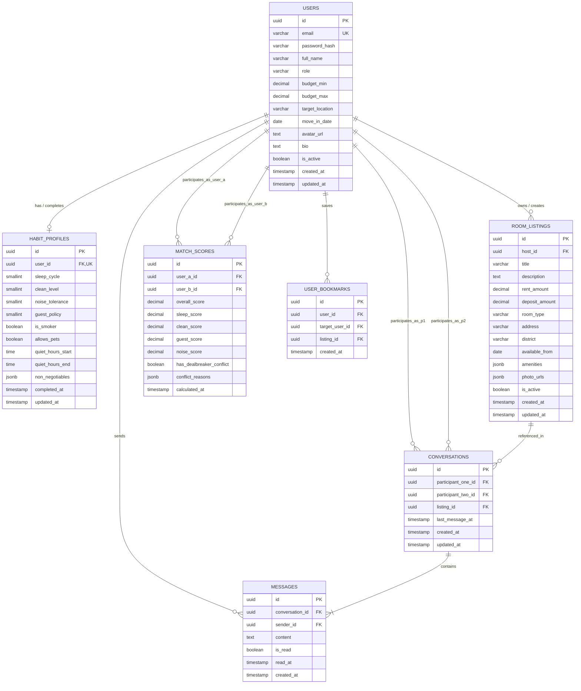
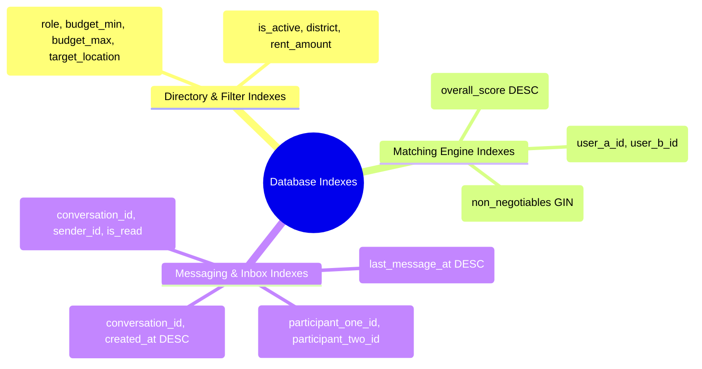

# Database Design Specification
## Behavior-Based Roommate Matching Web App

---

## Document Control

| Attribute | Details |
| :--- | :--- |
| **Project Title** | Behavior-Based Roommate Matching Web App |
| **Course** | 192-304 Agile Software Development (BSc IT - Year 3) |
| **Document Type** | Database Architecture & Schema Specification |
| **Target DBMS** | PostgreSQL 15+ (Relational with JSONB & Vector/Index Extensions) |
| **Version** | 1.0.0 |
| **Status** | Approved / Sprint Baseline |

---

## 1. Database Architecture & Overview

### 1.1 Purpose & Design Philosophy
The database is designed to support high-performance lifestyle matching, multi-criteria spatial/budget filtering, and low-latency real-time direct messaging.

Key principles:
1. **Third Normal Form (3NF) Baseline**: Eliminates transactional anomalies for user management, messaging, and listings.
2. **Hybrid Relational & JSONB Vector Modeling**: Stores core lifestyle attributes in structured columns for fast indexable arithmetic while utilizing `JSONB` for extensible house rule deal-breakers.
3. **Sub-50ms Query Optimization**: Dedicated compound B-Tree indexes on matching attributes and foreign keys to ensure instant directory filtering.
4. **Data Isolation & Privacy**: Separates sensitive authentication credentials from public profile summaries.

---

## 2. Conceptual Data Model & Entity-Relationship (ER) Diagram



---

## 3. Logical Data Dictionary

### 3.1 Table: `users`
Stores user identity, role, contact information, and primary housing preferences.

| Column Name | Data Type | Nullable | Constraints / Default | Description |
| :--- | :--- | :---: | :--- | :--- |
| `id` | `UUID` | **NO** | `PRIMARY KEY`, `gen_random_uuid()` | Unique user identifier |
| `email` | `VARCHAR(255)` | **NO** | `UNIQUE`, `CHECK (email ~* '^[A-Z0-9._%+-]+@[A-Z0-9.-]+\.[A-Z]{2,}$')` | Validated user email address |
| `password_hash` | `VARCHAR(255)` | **NO** | — | `bcrypt` hashed password string |
| `full_name` | `VARCHAR(100)` | **NO** | — | Display name of the user |
| `role` | `VARCHAR(20)` | **NO** | `CHECK (role IN ('seeker', 'lister', 'both'))` | Current user matching intention |
| `budget_min` | `NUMERIC(10, 2)`| YES | `CHECK (budget_min >= 0)` | Minimum monthly rent budget |
| `budget_max` | `NUMERIC(10, 2)`| YES | `CHECK (budget_max >= budget_min)` | Maximum monthly rent budget |
| `target_location` | `VARCHAR(100)`| YES | — | Preferred neighborhood/campus |
| `move_in_date` | `DATE` | YES | — | Target move-in timeline |
| `avatar_url` | `TEXT` | YES | — | Cloud storage URL for user picture |
| `bio` | `TEXT` | YES | `CHECK (length(bio) <= 1000)` | Short self-introduction |
| `is_verified` | `BOOLEAN` | **NO** | `DEFAULT FALSE` | Email / student ID verification status |
| `is_active` | `BOOLEAN` | **NO** | `DEFAULT TRUE` | Soft-delete / account active flag |
| `created_at` | `TIMESTAMPTZ` | **NO** | `DEFAULT CURRENT_TIMESTAMP` | Account creation timestamp |
| `updated_at` | `TIMESTAMPTZ` | **NO** | `DEFAULT CURRENT_TIMESTAMP` | Last profile update timestamp |

---

### 3.2 Table: `habit_profiles`
Encapsulates the 2-minute lifestyle assessment answers converted into numeric vectors for scoring.

| Column Name | Data Type | Nullable | Constraints / Default | Description |
| :--- | :--- | :---: | :--- | :--- |
| `id` | `UUID` | **NO** | `PRIMARY KEY`, `gen_random_uuid()` | Unique habit record ID |
| `user_id` | `UUID` | **NO** | `UNIQUE`, `REFERENCES users(id) ON DELETE CASCADE` | 1-to-1 link to user |
| `sleep_cycle` | `SMALLINT` | **NO** | `CHECK (sleep_cycle IN (1, 2, 3))` | `1`: Early Bird, `2`: Balanced, `3`: Night Owl |
| `clean_level` | `SMALLINT` | **NO** | `CHECK (clean_level IN (1, 2, 3))` | `1`: Spotless Daily, `2`: Moderate, `3`: Relaxed |
| `noise_tolerance`| `SMALLINT` | **NO** | `CHECK (noise_tolerance IN (1, 2, 3))` | `1`: Silence, `2`: Moderate, `3`: Lively |
| `guest_policy` | `SMALLINT` | **NO** | `CHECK (guest_policy IN (1, 2, 3))` | `1`: No Overnight, `2`: Weekends, `3`: Flexible |
| `is_smoker` | `BOOLEAN` | **NO** | `DEFAULT FALSE` | Smoking / vaping status |
| `allows_pets` | `BOOLEAN` | **NO** | `DEFAULT FALSE` | Pet ownership / comfort |
| `quiet_hours_start`| `TIME` | YES | `DEFAULT '23:00'` | Daily quiet hours start |
| `quiet_hours_end` | `TIME` | YES | `DEFAULT '07:00'` | Daily quiet hours end |
| `non_negotiables` | `JSONB` | **NO** | `DEFAULT '[]'::jsonb` | Array of deal-breaker strings |
| `completed_at` | `TIMESTAMPTZ` | **NO** | `DEFAULT CURRENT_TIMESTAMP` | Initial completion timestamp |
| `updated_at` | `TIMESTAMPTZ` | **NO** | `DEFAULT CURRENT_TIMESTAMP` | Last modification timestamp |

---

### 3.3 Table: `room_listings`
Stores housing vacancies posted by room listers / hosts.

| Column Name | Data Type | Nullable | Constraints / Default | Description |
| :--- | :--- | :---: | :--- | :--- |
| `id` | `UUID` | **NO** | `PRIMARY KEY`, `gen_random_uuid()` | Unique listing identifier |
| `host_id` | `UUID` | **NO** | `REFERENCES users(id) ON DELETE CASCADE` | Host user ID |
| `title` | `VARCHAR(150)` | **NO** | — | Listing headline |
| `description` | `TEXT` | YES | — | Detailed room/flat description |
| `rent_amount` | `NUMERIC(10, 2)`| **NO** | `CHECK (rent_amount > 0)` | Monthly rent fee |
| `deposit_amount`| `NUMERIC(10, 2)`| YES | `CHECK (deposit_amount >= 0)` | Security deposit |
| `room_type` | `VARCHAR(30)` | **NO** | `CHECK (room_type IN ('single', 'shared', 'master', 'studio'))` | Type of room |
| `address` | `VARCHAR(255)` | **NO** | — | Street address |
| `district` | `VARCHAR(100)` | **NO** | — | Neighborhood / District |
| `available_from`| `DATE` | **NO** | — | Availability date |
| `amenities` | `JSONB` | **NO** | `DEFAULT '[]'::jsonb` | e.g. `["wifi", "aircon", "private_bath"]` |
| `photo_urls` | `JSONB` | **NO** | `DEFAULT '[]'::jsonb` | Array of image asset URLs |
| `is_active` | `BOOLEAN` | **NO** | `DEFAULT TRUE` | Availability flag |
| `created_at` | `TIMESTAMPTZ` | **NO** | `DEFAULT CURRENT_TIMESTAMP` | Listing creation date |
| `updated_at` | `TIMESTAMPTZ` | **NO** | `DEFAULT CURRENT_TIMESTAMP` | Last update date |

---

### 3.4 Table: `match_scores`
Caches precomputed and on-demand compatibility scores between user pairs.

| Column Name | Data Type | Nullable | Constraints / Default | Description |
| :--- | :--- | :---: | :--- | :--- |
| `id` | `UUID` | **NO** | `PRIMARY KEY`, `gen_random_uuid()` | Unique score calculation ID |
| `user_a_id` | `UUID` | **NO** | `REFERENCES users(id) ON DELETE CASCADE` | User A ID |
| `user_b_id` | `UUID` | **NO** | `REFERENCES users(id) ON DELETE CASCADE` | User B ID (`user_a_id < user_b_id`) |
| `overall_score` | `NUMERIC(5, 2)`| **NO** | `CHECK (overall_score BETWEEN 0 AND 100)` | Overall match percentage ($0-100\%$) |
| `sleep_score` | `NUMERIC(5, 2)`| **NO** | `CHECK (sleep_score BETWEEN 0 AND 100)` | Sleep schedule compatibility |
| `clean_score` | `NUMERIC(5, 2)`| **NO** | `CHECK (clean_score BETWEEN 0 AND 100)` | Cleanliness compatibility |
| `guest_score` | `NUMERIC(5, 2)`| **NO** | `CHECK (guest_score BETWEEN 0 AND 100)` | Guest policy compatibility |
| `noise_score` | `NUMERIC(5, 2)`| **NO** | `CHECK (noise_score BETWEEN 0 AND 100)` | Noise tolerance compatibility |
| `has_dealbreaker_conflict` | `BOOLEAN` | **NO** | `DEFAULT FALSE` | Flag for hard deal-breaker triggers |
| `conflict_reasons` | `JSONB` | **NO** | `DEFAULT '[]'::jsonb` | Explanation of flagged rule mismatches |
| `calculated_at`| `TIMESTAMPTZ` | **NO** | `DEFAULT CURRENT_TIMESTAMP` | Calculation timestamp |

---

### 3.5 Table: `conversations`
Tracks active direct messaging threads between two users.

| Column Name | Data Type | Nullable | Constraints / Default | Description |
| :--- | :--- | :---: | :--- | :--- |
| `id` | `UUID` | **NO** | `PRIMARY KEY`, `gen_random_uuid()` | Unique conversation ID |
| `participant_one_id` | `UUID` | **NO** | `REFERENCES users(id) ON DELETE CASCADE` | First participant |
| `participant_two_id` | `UUID` | **NO** | `REFERENCES users(id) ON DELETE CASCADE` | Second participant (`p1 < p2`) |
| `listing_id` | `UUID` | YES | `REFERENCES room_listings(id) ON DELETE SET NULL` | Optional associated room listing |
| `last_message_at` | `TIMESTAMPTZ` | **NO** | `DEFAULT CURRENT_TIMESTAMP` | Sort index for inbox list |
| `created_at` | `TIMESTAMPTZ` | **NO** | `DEFAULT CURRENT_TIMESTAMP` | Channel creation timestamp |
| `updated_at` | `TIMESTAMPTZ` | **NO** | `DEFAULT CURRENT_TIMESTAMP` | Last channel update |

---

### 3.6 Table: `messages`
Stores individual chat messages sent in a conversation.

| Column Name | Data Type | Nullable | Constraints / Default | Description |
| :--- | :--- | :---: | :--- | :--- |
| `id` | `UUID` | **NO** | `PRIMARY KEY`, `gen_random_uuid()` | Unique message ID |
| `conversation_id` | `UUID` | **NO** | `REFERENCES conversations(id) ON DELETE CASCADE` | Parent conversation |
| `sender_id` | `UUID` | **NO** | `REFERENCES users(id) ON DELETE CASCADE` | Author user ID |
| `content` | `TEXT` | **NO** | `CHECK (length(trim(content)) > 0)` | Sanitized text message body |
| `is_read` | `BOOLEAN` | **NO** | `DEFAULT FALSE` | Read receipt flag |
| `read_at` | `TIMESTAMPTZ` | YES | — | Exact timestamp read by recipient |
| `created_at` | `TIMESTAMPTZ` | **NO** | `DEFAULT CURRENT_TIMESTAMP` | Message timestamp |

---

## 4. Indexing & Query Optimization Strategy

To guarantee the $<50\text{ms}$ query latency requirement for the candidate directory and real-time chat, the following index design is enforced:



### Index Specifications:
1. **User Discovery Index**:
   ```sql
   CREATE INDEX idx_users_discovery ON users (role, is_active, budget_min, budget_max);
   ```
2. **Match Score Lookup & Rank**:
   ```sql
   CREATE UNIQUE INDEX idx_match_pair ON match_scores (user_a_id, user_b_id);
   CREATE INDEX idx_match_score_desc ON match_scores (user_a_id, overall_score DESC);
   ```
3. **JSONB Deal-Breaker GIN Index**:
   ```sql
   CREATE INDEX idx_habits_dealbreakers ON habit_profiles USING GIN (non_negotiables);
   ```
4. **Chat Message Stream Index**:
   ```sql
   CREATE INDEX idx_messages_stream ON messages (conversation_id, created_at ASC);
   CREATE INDEX idx_messages_unread_count ON messages (conversation_id, is_read) WHERE is_read = FALSE;
   ```

---

## 5. Physical Database DDL Script (PostgreSQL 15+)

```sql
-- ============================================================================
-- SCHEMA: Behavior-Based Roommate Matching Web App
-- COURSE: 192-304 Agile Software Development
-- ============================================================================

-- 1. Enable Required Extensions
CREATE EXTENSION IF NOT EXISTS "uuid-ossp";
CREATE EXTENSION IF NOT EXISTS "pgcrypto";

-- 2. Automatic updated_at Trigger Function
CREATE OR REPLACE FUNCTION update_timestamp()
RETURNS TRIGGER AS $$
BEGIN
    NEW.updated_at = CURRENT_TIMESTAMP;
    RETURN NEW;
END;
$$ LANGUAGE plpgsql;

-- 3. Table: users
CREATE TABLE users (
    id UUID PRIMARY KEY DEFAULT gen_random_uuid(),
    email VARCHAR(255) NOT NULL UNIQUE,
    password_hash VARCHAR(255) NOT NULL,
    full_name VARCHAR(100) NOT NULL,
    role VARCHAR(20) NOT NULL DEFAULT 'seeker',
    budget_min NUMERIC(10, 2) DEFAULT 0.00,
    budget_max NUMERIC(10, 2) DEFAULT 1000.00,
    target_location VARCHAR(100),
    move_in_date DATE,
    avatar_url TEXT,
    bio TEXT,
    is_verified BOOLEAN NOT NULL DEFAULT FALSE,
    is_active BOOLEAN NOT NULL DEFAULT TRUE,
    created_at TIMESTAMPTZ NOT NULL DEFAULT CURRENT_TIMESTAMP,
    updated_at TIMESTAMPTZ NOT NULL DEFAULT CURRENT_TIMESTAMP,
    CONSTRAINT chk_user_role CHECK (role IN ('seeker', 'lister', 'both')),
    CONSTRAINT chk_user_budget CHECK (budget_max >= budget_min)
);

CREATE TRIGGER trg_users_updated_at
BEFORE UPDATE ON users
FOR EACH ROW EXECUTE FUNCTION update_timestamp();

-- 4. Table: habit_profiles
CREATE TABLE habit_profiles (
    id UUID PRIMARY KEY DEFAULT gen_random_uuid(),
    user_id UUID NOT NULL UNIQUE REFERENCES users(id) ON DELETE CASCADE,
    sleep_cycle SMALLINT NOT NULL,
    clean_level SMALLINT NOT NULL,
    noise_tolerance SMALLINT NOT NULL,
    guest_policy SMALLINT NOT NULL,
    is_smoker BOOLEAN NOT NULL DEFAULT FALSE,
    allows_pets BOOLEAN NOT NULL DEFAULT FALSE,
    quiet_hours_start TIME DEFAULT '23:00',
    quiet_hours_end TIME DEFAULT '07:00',
    non_negotiables JSONB NOT NULL DEFAULT '[]'::jsonb,
    completed_at TIMESTAMPTZ NOT NULL DEFAULT CURRENT_TIMESTAMP,
    updated_at TIMESTAMPTZ NOT NULL DEFAULT CURRENT_TIMESTAMP,
    CONSTRAINT chk_sleep_cycle CHECK (sleep_cycle BETWEEN 1 AND 3),
    CONSTRAINT chk_clean_level CHECK (clean_level BETWEEN 1 AND 3),
    CONSTRAINT chk_noise_tolerance CHECK (noise_tolerance BETWEEN 1 AND 3),
    CONSTRAINT chk_guest_policy CHECK (guest_policy BETWEEN 1 AND 3)
);

CREATE TRIGGER trg_habit_profiles_updated_at
BEFORE UPDATE ON habit_profiles
FOR EACH ROW EXECUTE FUNCTION update_timestamp();

-- 5. Table: room_listings
CREATE TABLE room_listings (
    id UUID PRIMARY KEY DEFAULT gen_random_uuid(),
    host_id UUID NOT NULL REFERENCES users(id) ON DELETE CASCADE,
    title VARCHAR(150) NOT NULL,
    description TEXT,
    rent_amount NUMERIC(10, 2) NOT NULL,
    deposit_amount NUMERIC(10, 2) DEFAULT 0.00,
    room_type VARCHAR(30) NOT NULL DEFAULT 'single',
    address VARCHAR(255) NOT NULL,
    district VARCHAR(100) NOT NULL,
    available_from DATE NOT NULL,
    amenities JSONB NOT NULL DEFAULT '[]'::jsonb,
    photo_urls JSONB NOT NULL DEFAULT '[]'::jsonb,
    is_active BOOLEAN NOT NULL DEFAULT TRUE,
    created_at TIMESTAMPTZ NOT NULL DEFAULT CURRENT_TIMESTAMP,
    updated_at TIMESTAMPTZ NOT NULL DEFAULT CURRENT_TIMESTAMP,
    CONSTRAINT chk_room_type CHECK (room_type IN ('single', 'shared', 'master', 'studio')),
    CONSTRAINT chk_rent_positive CHECK (rent_amount > 0)
);

CREATE TRIGGER trg_room_listings_updated_at
BEFORE UPDATE ON room_listings
FOR EACH ROW EXECUTE FUNCTION update_timestamp();

-- 6. Table: match_scores
CREATE TABLE match_scores (
    id UUID PRIMARY KEY DEFAULT gen_random_uuid(),
    user_a_id UUID NOT NULL REFERENCES users(id) ON DELETE CASCADE,
    user_b_id UUID NOT NULL REFERENCES users(id) ON DELETE CASCADE,
    overall_score NUMERIC(5, 2) NOT NULL,
    sleep_score NUMERIC(5, 2) NOT NULL,
    clean_score NUMERIC(5, 2) NOT NULL,
    guest_score NUMERIC(5, 2) NOT NULL,
    noise_score NUMERIC(5, 2) NOT NULL,
    has_dealbreaker_conflict BOOLEAN NOT NULL DEFAULT FALSE,
    conflict_reasons JSONB NOT NULL DEFAULT '[]'::jsonb,
    calculated_at TIMESTAMPTZ NOT NULL DEFAULT CURRENT_TIMESTAMP,
    CONSTRAINT chk_pair_order CHECK (user_a_id < user_b_id),
    CONSTRAINT chk_overall_score CHECK (overall_score BETWEEN 0 AND 100),
    CONSTRAINT uq_match_pair UNIQUE (user_a_id, user_b_id)
);

-- 7. Table: conversations
CREATE TABLE conversations (
    id UUID PRIMARY KEY DEFAULT gen_random_uuid(),
    participant_one_id UUID NOT NULL REFERENCES users(id) ON DELETE CASCADE,
    participant_two_id UUID NOT NULL REFERENCES users(id) ON DELETE CASCADE,
    listing_id UUID REFERENCES room_listings(id) ON DELETE SET NULL,
    last_message_at TIMESTAMPTZ NOT NULL DEFAULT CURRENT_TIMESTAMP,
    created_at TIMESTAMPTZ NOT NULL DEFAULT CURRENT_TIMESTAMP,
    updated_at TIMESTAMPTZ NOT NULL DEFAULT CURRENT_TIMESTAMP,
    CONSTRAINT chk_conversation_participants CHECK (participant_one_id < participant_two_id),
    CONSTRAINT uq_conversation_pair UNIQUE (participant_one_id, participant_two_id)
);

CREATE TRIGGER trg_conversations_updated_at
BEFORE UPDATE ON conversations
FOR EACH ROW EXECUTE FUNCTION update_timestamp();

-- 8. Table: messages
CREATE TABLE messages (
    id UUID PRIMARY KEY DEFAULT gen_random_uuid(),
    conversation_id UUID NOT NULL REFERENCES conversations(id) ON DELETE CASCADE,
    sender_id UUID NOT NULL REFERENCES users(id) ON DELETE CASCADE,
    content TEXT NOT NULL,
    is_read BOOLEAN NOT NULL DEFAULT FALSE,
    read_at TIMESTAMPTZ,
    created_at TIMESTAMPTZ NOT NULL DEFAULT CURRENT_TIMESTAMP,
    CONSTRAINT chk_message_content_not_empty CHECK (length(trim(content)) > 0)
);

-- 9. Table: user_bookmarks
CREATE TABLE user_bookmarks (
    id UUID PRIMARY KEY DEFAULT gen_random_uuid(),
    user_id UUID NOT NULL REFERENCES users(id) ON DELETE CASCADE,
    target_user_id UUID REFERENCES users(id) ON DELETE CASCADE,
    listing_id UUID REFERENCES room_listings(id) ON DELETE CASCADE,
    created_at TIMESTAMPTZ NOT NULL DEFAULT CURRENT_TIMESTAMP,
    CONSTRAINT chk_bookmark_target CHECK (
        (target_user_id IS NOT NULL AND listing_id IS NULL) OR 
        (target_user_id IS NULL AND listing_id IS NOT NULL)
    )
);

-- 10. Performance Indexes
CREATE INDEX idx_users_discovery ON users (role, is_active, budget_min, budget_max);
CREATE INDEX idx_listings_active_filter ON room_listings (is_active, district, rent_amount);
CREATE INDEX idx_match_score_lookup ON match_scores (user_a_id, overall_score DESC);
CREATE INDEX idx_habit_dealbreakers ON habit_profiles USING GIN (non_negotiables);
CREATE INDEX idx_conversations_inbox ON conversations (participant_one_id, participant_two_id, last_message_at DESC);
CREATE INDEX idx_messages_chat_stream ON messages (conversation_id, created_at ASC);
CREATE INDEX idx_messages_unread ON messages (conversation_id, is_read) WHERE is_read = FALSE;
```

---

## 6. Data Integrity & Privacy Protection

1. **Foreign Key Cascades**:
   * Deleting a user account cascades to delete their `habit_profiles`, `match_scores`, and authored `messages` to guarantee GDPR/PDPA right-to-erasure compliance.
2. **Deterministic Pair Ordering**:
   * For bidirectional relations (`match_scores`, `conversations`), the constraint `user_a_id < user_b_id` prevents duplicate redundant rows `(User1, User2)` and `(User2, User1)`.
3. **Password & PII Isolation**:
   * `password_hash` is strictly inaccessible to public API queries.
   * `habit_profiles.non_negotiables` are parsed server-side to generate compatibility tags without exposing sensitive medical/personal answers.

---

## 7. Migration & Seeding Plan (Agile Sprints)

| Sprint | Migration Step | Target Tables | Purpose |
| :---: | :--- | :--- | :--- |
| **Sprint 0** | `001_initial_schema.sql` | `users`, `habit_profiles` | Core account creation and quiz questionnaire setup |
| **Sprint 1** | `002_matching_engine.sql` | `match_scores` | Mathematical scoring persistence and caching |
| **Sprint 2** | `003_listings_bookmarks.sql` | `room_listings`, `user_bookmarks` | Room posting and saved roommate bookmarks |
| **Sprint 3** | `004_messaging_system.sql` | `conversations`, `messages` | Real-time chat storage and unread counters |
| **Sprint 4** | `005_indexes_and_perf.sql` | All Indexes & Triggers | Production performance tuning & query stress testing |

---

## 8. Stakeholder Sign-Off

| Stakeholder Role | Representative | Signature / Status | Date |
| :--- | :--- | :--- | :--- |
| **Database Architect / Lead Dev** | Development Team Lead | Approved | 2026-09-01 |
| **Product Owner** | Project Team Representative | Approved | 2026-09-01 |
| **Course Assessor** | 192-304 Agile Instructor | Pending Evaluation | — |
