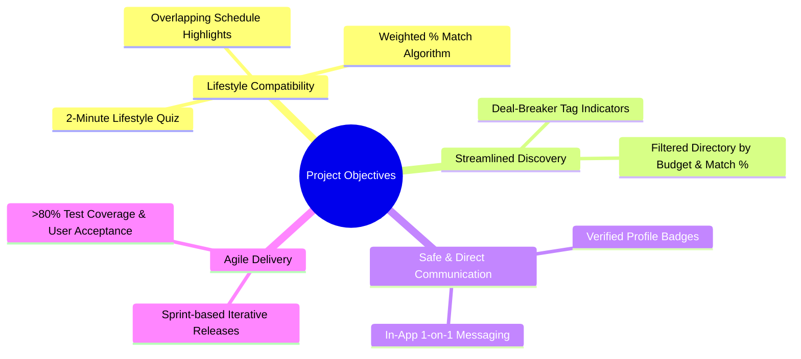
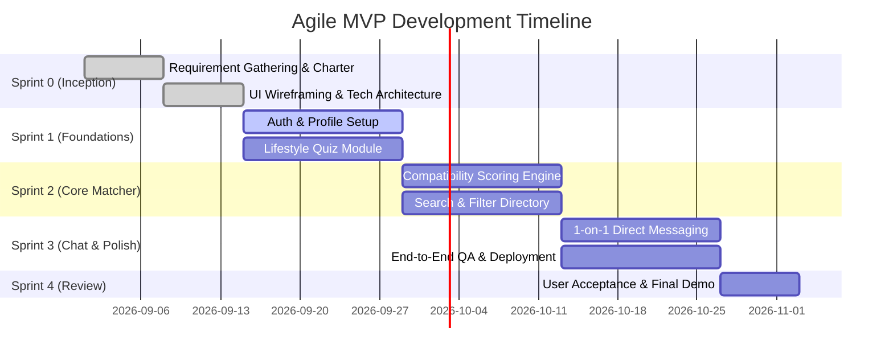

# Project Charter: Behavior-Based Roommate Matching Web App

---

## 1. Project Identification & Metadata

| Attribute | Details |
| :--- | :--- |
| **Project Title** | Behavior-Based Roommate Matching Web Application |
| **Course / Program** | 192-304 Agile Software Development — BSc in Information Technology (Year 3) |
| **Project Type** | Web Application (Full-Stack Agile MVP) |
| **Document Version** | 1.0.0 |
| **Status** | Approved / Active |
| **Target Delivery** | Academic Semester / Agile Sprint Cycles |

---

## 2. Executive Summary & Vision Statement

### 2.1 Vision Statement
> *"To eliminate co-living friction and awkward tenant screening by empowering renters and room posters to find living partners based on true behavioral compatibility, shared lifestyle habits, and mutual living boundaries."*

### 2.2 Project Summary
Traditional roommate searching relies heavily on room photographs, rental costs, and geographic proximity, while ignoring the primary root cause of roommate conflict: **daily lifestyle habits and behavioral mismatches**. 

The **Behavior-Based Roommate Matching Web App** provides an intelligent, habit-driven matching platform. Through an intuitive 2-minute lifestyle assessment, the platform algorithmically computes a **Compatibility Match Percentage (%)**, highlights lifestyle tags, and allows pre-screened direct communication between renters and room posters.

---

## 3. Problem Statement & Justification

### 3.1 Core Pain Points (Empathy & Discovery)
1. **Sleep Cycle & Routine Friction**: Early risers paired with late-night gamers/workers create daily noise disruptions and sleep deprivation.
2. **Cleaning & Chore Standard Mismatch**: Inconsistent cleanliness expectations and unwashed dishes lead to shared-space resentment.
3. **Screening Discomfort & Privacy Boundaries**: Renters find it awkward to ask direct personal questions (e.g., guest frequency, smoking, pet habits, quiet hours) through open social media chats.
4. **Inefficient Roommate Screening**: Room posters receive unstructured, repetitive social media inquiries with no upfront qualification of compatibility.

### 3.2 Strategic Justification & Value Proposition
* **Core Problem Fit**: Solves living compatibility before lease signing rather than after conflict arises.
* **Organic Growth**: High incentive for university students and young professionals to share match profile links in university portals and housing groups.
* **Scalability & Reusability**: Applicable across university campuses, metropolitan areas, and shared accommodation markets without redesigning the core system.

---

## 4. Project Objectives & Success Criteria (SMART)

* **Specific**: Deliver a responsive web application featuring a lifestyle quiz, match scoring engine, filtered candidate directory, and 1-on-1 chat.
* **Measurable**: 
  * Lifestyle quiz completion time $< 2$ minutes.
  * Matching algorithm precision yielding $> 85\%$ user-reported compatibility satisfaction in user testing.
  * $> 90\%$ pass rate on acceptance criteria across all sprint user stories.
* **Achievable**: Scope constrained to core MVP features utilizing modern web technologies and agile sprint workflows.
* **Relevant**: Directly satisfies course requirements for **192-304 Agile Software Development** and addresses verified user pain points.
* **Time-bound**: Delivered across iterative 2-week sprints within the semester timeline.

---

## 5. Scope Management

### 5.1 In-Scope (Minimum Viable Product - MVP)
* **Habit & Lifestyle Assessment Quiz**:
  * 2-minute questionnaire covering sleep/wake schedules, cleaning frequency, noise tolerance, guest policies, smoking/drinking, and pet preferences.
* **Behavioral Compatibility Engine**:
  * Calculates weighted % match score between users.
  * Visual compatibility breakdown and lifestyle highlight tags.
* **Filtered Roommate & Room Directory**:
  * Filter candidates by target location, budget range, gender preferences, and minimum match percentage (e.g., $\ge 80\%$).
* **User Profile & Boundary Management**:
  * Visual profile cards showing bio, budget, daily routine matrix, and non-negotiable living rules.
* **1-on-1 In-App Direct Messaging**:
  * Secure direct chat for matched users to discuss room details and arrange in-person/virtual meetups.
* **Authentication & Basic Profile Management**:
  * Secure student/user signup, login, and profile editing.

### 5.2 Out-of-Scope (Future Iterations / Post-MVP)
* Integrated online rent payment / escrow transactions.
* Legal tenancy contract generation and digital signature handling.
* Background credit checks and third-party identity verification.
* Native mobile applications (iOS / Android) — MVP will be mobile-responsive web.
* AI-driven chatbot assistant for roommate dispute resolution.

---

## 6. Target Audience & Stakeholders

### 6.1 Primary Stakeholders
| Stakeholder Role | Description / Responsibilities |
| :--- | :--- |
| **Course Instructor / Assessor** | Evaluates agile adherence, sprint documentation, engineering quality, and project outcomes for 192-304 Agile. |
| **Product Owner (PO)** | Defines user stories, maintains backlog priority, accepts sprint deliverables. |
| **Scrum Master (SM)** | Facilitates agile ceremonies, removes blockers, tracks team velocity and burndown. |
| **Development Team** | Full-stack developers, UI/UX designers, and QA engineers responsible for increment delivery. |

### 6.2 Target User Personas
1. **University Student (Room Seeker)**: Needs quiet study environment, strict budget, looking for peer with matching sleep schedule.
2. **Young Working Professional (Room Lister)**: Has a spare room, works standard business hours, seeks tidy, respectful co-tenant without awkward interview rounds.
3. **Privacy-Oriented Tenant**: Values clear upfront house rules and quiet hours before committing to lease talks.

---

## 7. High-Level Agile Release Roadmap & Sprint Plan

### Sprint Milestones Overview
* **Sprint 0 — Project Inception & Architecture**:
  * Finalize Project Charter, Backlog, Wireframes, and ER Diagrams.
  * Setup CI/CD pipeline, repository structure, and linting standards.
* **Sprint 1 — User Authentication & Lifestyle Assessment**:
  * User registration and authentication.
  * Interactive 2-minute Lifestyle & Habit Assessment form with state persistence.
* **Sprint 2 — Compatibility Scoring & Filtered Directory**:
  * Weighted algorithmic match scoring.
  * Search, filter, and profile comparison cards with match badges.
* **Sprint 3 — Real-Time 1-on-1 Chat & MVP Hardening**:
  * In-app messaging system for compatible matches.
  * Security checks, responsive design polish, and performance optimization.
* **Sprint 4 — Agile Showcase, Testing & Final Release**:
  * User acceptance testing (UAT), bug resolution, sprint retrospective, and project demonstration.

---

## 8. Technical Architecture & Technology Stack

| Layer | Recommended Technology | Rationale |
| :--- | :--- | :--- |
| **Frontend UI** | React.js / Next.js + Tailwind CSS | Component-based, rapid UI prototyping, responsive mobile-first design. |
| **Backend API** | Node.js (Express.js) / FastAPI (Python) | High concurrency, lightweight RESTful endpoints for quiz and messaging. |
| **Database** | PostgreSQL / MongoDB | Structured storage for user habit vectors, profiles, and relational matching queries. |
| **Real-time Messaging** | WebSocket / Socket.io / Firebase | Instant low-latency 1-on-1 text communication. |
| **Version Control & CI/CD** | GitHub + GitHub Actions | Automated linting, test suites, and continuous deployment. |
| **Hosting / Cloud** | Vercel / Render / Supabase | Cost-effective, seamless deployment suitable for agile demonstrations. |

---

## 9. Risk Management Matrix

| Risk ID | Risk Description | Impact | Probability | Mitigation Strategy |
| :---: | :--- | :---: | :---: | :--- |
| **R-01** | Matching algorithm produces skewed or unhelpful score distributions. | High | Medium | Implement normalized weighted scoring across standard categories (Sleep, Cleanliness, Noise, Guests) and conduct iterative test scoring with synthetic persona sets. |
| **R-02** | Scope creep causing missed sprint deadlines. | High | Medium | Enforce strict Definition of Ready (DoR) and Definition of Done (DoD); defer non-essential features (e.g., payments, native apps) to post-MVP backlog. |
| **R-03** | User privacy concerns regarding personal habit disclosure. | Medium | Medium | Display aggregate compatibility percentages and high-level tags rather than revealing private questionnaire responses without consent. |
| **R-04** | Communication delays in in-app chat leading to drop-offs. | Medium | Low | Ensure responsive WebSocket architecture with clear online/unread notification cues. |

---

## 10. Agile Governance & Definition of Done (DoD)

### 10.1 Agile Ceremonies
* **Sprint Planning**: Held at the start of each 2-week cycle to estimate story points and commit to sprint backlogs.
* **Daily Standups (Async / Sync)**: 15-minute sync addressing: (1) What was done yesterday? (2) What will be done today? (3) Any blockers?
* **Sprint Review & Demo**: Demonstration of working software increments to stakeholders/instructors.
* **Sprint Retrospective**: Team reflection on process improvements, team dynamics, and tool efficiency.

### 10.2 Definition of Done (DoD)
A User Story is marked **Done** only when:
1. Code is written, peer-reviewed via Pull Request, and merged into the main branch.
2. Unit tests and functional tests pass with acceptable code coverage.
3. Acceptance criteria defined in the user story are fully validated.
4. UI is responsive across desktop and mobile screens.
5. Deployed to the staging/preview environment with no critical defects.

---

## 11. Charter Approval & Sign-Off

| Stakeholder / Role | Name / Representative | Signature / Status | Date |
| :--- | :--- | :--- | :--- |
| **Product Owner** | Project Team Representative | Approved | 2026-09-01 |
| **Scrum Master** | Project Team Representative | Approved | 2026-09-01 |
| **Lead Developer** | Development Team Lead | Approved | 2026-09-01 |
| **Academic Instructor** | Course Coordinator (192-304 Agile) | Pending Review | — |
