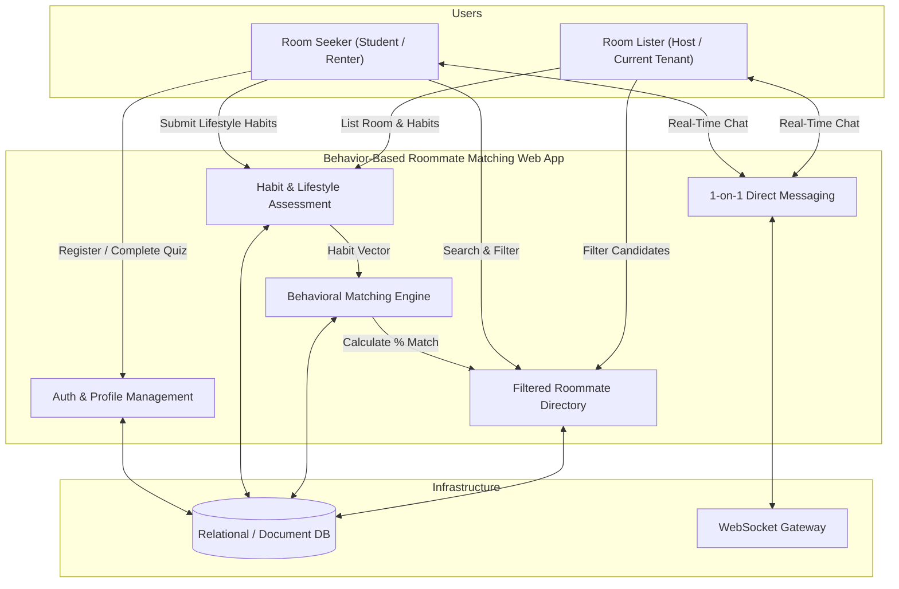
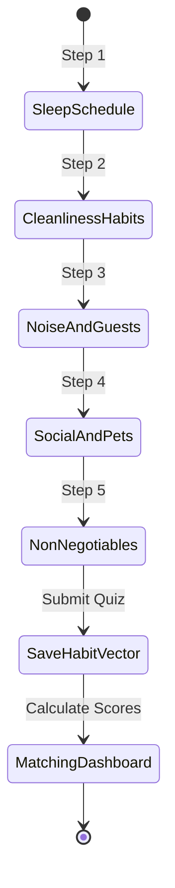
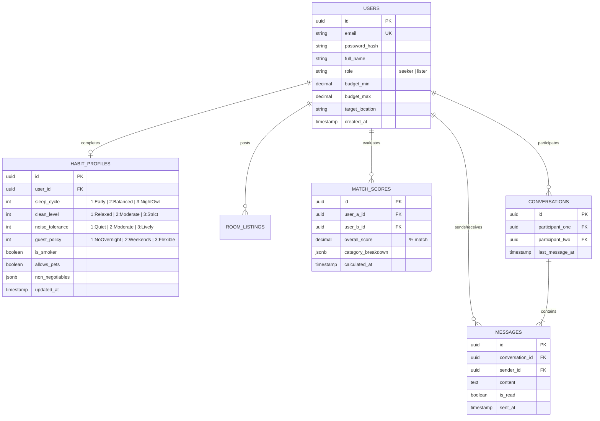

# Software Requirements Specification (SRS)
## Behavior-Based Roommate Matching Web App

---

## Document Control

| Attribute | Details |
| :--- | :--- |
| **Project Title** | Behavior-Based Roommate Matching Web App |
| **Course** | 192-304 Agile Software Development (BSc IT - Year 3) |
| **Document Type** | Agile Software Requirements Specification (SRS) |
| **Version** | 1.0.0 |
| **Status** | Approved / Baseline for Sprints |
| **Target System** | Responsive Web Application (Desktop & Mobile Web) |

---

## 1. Introduction

### 1.1 Purpose
This Software Requirements Specification (SRS) defines the functional and non-functional requirements for the **Behavior-Based Roommate Matching Web App**. It serves as the primary contract between the Product Owner, Agile Development Team, and Academic Evaluators for sprint planning, backlog grooming, and acceptance testing.

### 1.2 Scope of the Product
The system is a lifestyle-centric roommate discovery web platform. Unlike conventional rental boards that focus purely on square footage and price, this application evaluates compatibility across daily living habits (sleep cycles, cleanliness, guest policies, noise tolerances) to connect compatible roommates and streamline tenant screening.

### 1.3 Definitions, Acronyms, and Abbreviations
* **SRS**: Software Requirements Specification
* **MVP**: Minimum Viable Product
* **MoSCoW**: Must have, Should have, Could have, Won't have (Prioritization framework)
* **JWT**: JSON Web Token (Authentication mechanism)
* **DoD**: Definition of Done
* **DoR**: Definition of Ready
* **Gherkin**: Given-When-Then syntax for acceptance criteria (BDD)

---

## 2. Overall Description & System Context

### 2.1 Product Perspective & Context Diagram



### 2.2 User Classes and Characteristics
1. **Room Seeker (Primary Consumer)**:
   * University students or young professionals looking for a shared room or co-tenant.
   * Prioritizes schedule harmony, budget constraints, and quiet study/sleep hours.
2. **Room Lister / Host (Primary Provider)**:
   * Individuals with an available room seeking a compatible roommate.
   * Prioritizes pre-screened applicants to avoid awkward interviews and high tenant turnover.
3. **System Administrator (Secondary)**:
   * Manages user moderation, reports, and system telemetry.

### 2.3 Operating Environment & Technical Constraints
* **Client**: Modern web browsers (Chrome $\ge 110$, Safari $\ge 16$, Firefox $\ge 110$, Edge $\ge 110$) on Mobile, Tablet, and Desktop.
* **Server Runtime**: Node.js LTS or Python 3.11+.
* **Database**: PostgreSQL 15+ / MongoDB 6.0+.
* **Protocol**: HTTPS / WSS (WebSockets over TLS).

---

## 3. Functional Requirements (User Stories & Epics)

Requirements are prioritized using the **MoSCoW** convention:
* **[MUST]**: Mandatory for MVP release.
* **[SHOULD]**: High-value feature included if sprint capacity permits.
* **[COULD]**: Desirable enhancement for post-MVP.
* **[WON'T]**: Out of scope for current semester release.

---

### Epic 1: Authentication & User Profiles

#### `FR-AUTH-01` [MUST] User Registration & Authentication
* **User Story**: *As a new user, I want to create an account using my email and a secure password so that I can access my profile and matching dashboard.*
* **Acceptance Criteria (Gherkin)**:
  ```gherkin
  Scenario: Successful user registration
    Given the user is on the registration page
    When the user submits a valid email, name, and password with at least 8 characters
    Then the system creates the account, generates a secure session token (JWT), and redirects to the lifestyle quiz.

  Scenario: Duplicate email registration
    Given an account already exists with "user@university.edu"
    When a user attempts to register with "user@university.edu"
    Then the system displays an error message: "Email is already registered."
  ```

#### `FR-AUTH-02` [MUST] User Profile & Housing Preference Setup
* **User Story**: *As a registered user, I want to set up my profile with my bio, budget range, preferred location, and move-in date so that potential roommates know my logistical constraints.*
* **Acceptance Criteria**:
  * User can upload a profile avatar and set budget (Min/Max per month).
  * User can toggle their role: "Looking for a Room" vs. "Has a Room to Fill".

---

### Epic 2: Habit & Lifestyle Assessment Quiz



#### `FR-QUIZ-01` [MUST] 2-Minute Lifestyle & Habit Questionnaire
* **User Story**: *As a user, I want to complete a rapid multi-step lifestyle assessment so that the platform understands my daily routine without requiring long essays.*
* **Quiz Dimension Specifications**:
  1. **Sleep & Wake Schedule**: Early bird (Sleep 22:00, Wake 06:00), Balanced (00:00 - 08:00), Night owl (02:00 - 10:00).
  2. **Cleanliness Standards**: Daily deep-clean, standard tidy, relaxed/weekend chore schedule; dishwashing immediacy.
  3. **Noise & Study Environment**: Complete silence required, background noise acceptable, loud music/gaming allowed.
  4. **Guest & Party Policy**: No overnight guests, occasional weekend guests, frequent social gatherings.
  5. **Substance & Pet Habits**: Smoking/vaping (yes/no/outdoor only), pet owner/allergy status.
* **Acceptance Criteria (Gherkin)**:
  ```gherkin
  Scenario: Completing the quiz under 2 minutes
    Given the user opens the lifestyle quiz
    When the user answers all 5 dimension steps and clicks "Submit"
    Then the system saves the habit vector and displays the computed matching directory within 1 second.
  ```

#### `FR-QUIZ-02` [SHOULD] Habit Profile Editing & Recalibration
* **User Story**: *As a user whose routine has changed, I want to update my quiz responses so that my match scores remain accurate.*
* **Acceptance Criteria**:
  * Changes immediately trigger recalculation of compatibility scores against existing profiles.

---

### Epic 3: Behavioral Compatibility & Matching Engine

#### `FR-ENG-01` [MUST] Weighted Compatibility Algorithm
* **User Story**: *As a user browsing candidates, I want to see an overall Compatibility Percentage (%) with each profile so that I can quickly identify the most suitable roommates.*
* **Algorithm Mathematical Formulation**:
  The total compatibility score $S_{total}(A, B)$ between User $A$ and User $B$ across $N$ lifestyle dimensions is calculated as:

  $$S_{total}(A, B) = \sum_{i=1}^{N} \left( W_i \times \text{Similarity}(A_i, B_i) \right) - \text{Penalty}_{dealbreakers}$$

  Where:
  * $W_i$ represents the category weight ($\sum W_i = 100\%$).
    * **Sleep Cycle Harmony**: $30\%$
    * **Cleanliness & Chores**: $25\%$
    * **Guest & Privacy Rules**: $25\%$
    * **Noise & Study Habits**: $20\%$
  * $\text{Similarity}(A_i, B_i) \in [0, 1]$ computes Euclidean or category distance between habit responses.
  * $\text{Penalty}_{dealbreakers} = 50\%$ if hard constraints conflict (e.g., severe pet allergy vs. active pet).

* **Acceptance Criteria (Gherkin)**:
  ```gherkin
  Scenario: Score calculation between aligned roommates
    Given User A and User B have identical sleep and cleanliness responses
    When the matching engine computes their score
    Then the displayed match percentage is greater than or equal to 90%.

  Scenario: Hard deal-breaker penalty
    Given User A specifies "Strictly Non-Smoking" as a non-negotiable
    And User B is a regular indoor smoker
    When the compatibility score is calculated
    Then the score applies the deal-breaker penalty and flags the mismatch on the profile card.
  ```

#### `FR-ENG-02` [SHOULD] Visual Compatibility Breakdown & Routine Matrix
* **User Story**: *As a user, I want to see a visual breakdown of where our habits align (e.g., "Both Night Owls", "Shared Cleaning Habits") so that I understand why we matched.*
* **Acceptance Criteria**:
  * Profile view renders green tag badges for high-alignment habits and amber badges for minor mismatches.

---

### Epic 4: Filtered Roommate & Room Directory

#### `FR-DIR-01` [MUST] Search and Multi-Criteria Filtering
* **User Story**: *As a room seeker, I want to filter candidate listings by minimum compatibility percentage, budget, and location so that I only spend time reviewing relevant options.*
* **Acceptance Criteria**:
  * Filtering options include:
    * Minimum Match Score slider (e.g., $70\%, 80\%, 90\%$).
    * Budget Range (Min / Max slider).
    * Location / Campus proximity filter.
    * Housing Status (Has a room / Needs a room).
  * Filter results update dynamically without full page reload.

#### `FR-DIR-02` [MUST] Candidate Profile Detail Card
* **User Story**: *As a user, I want to click on a candidate's profile card to view their complete compatibility summary, bio, budget, and house rules.*
* **Acceptance Criteria**:
  * Displays user avatar, name, verification badge, match %, budget, location, and non-negotiable living rules.
  * Includes a direct "Message" button that initiates a chat thread.

---

### Epic 5: 1-on-1 Direct Messaging

#### `FR-CHAT-01` [MUST] Secure In-App Direct Chat
* **User Story**: *As a user who found a high-compatibility match, I want to send direct messages in-app so that I can discuss apartment viewings without sharing personal phone numbers immediately.*
* **Acceptance Criteria (Gherkin)**:
  ```gherkin
  Scenario: Sending a real-time message
    Given User A is on User B's profile page (Match Score >= 75%)
    When User A clicks "Message" and sends "Hi, are you still looking for a roommate?"
    Then the message is saved to the database and delivered instantly to User B's active conversation view.
  ```

#### `FR-CHAT-02` [MUST] Conversation List & Unread Indicators
* **User Story**: *As a user with multiple active inquiries, I want an inbox showing all my conversation threads with unread message badges so that I don't miss inquiries.*
* **Acceptance Criteria**:
  * Displays active chat threads sorted by most recent message.
  * Shows unread counter badges for new incoming messages.

---

## 4. Non-Functional Requirements (NFRs)

```mermaid
quadrantChart
    title Non-Functional Requirements Prioritization
    x-axis Low Technical Complexity --> High Technical Complexity
    y-axis Low System Impact --> Critical System Impact
    quadrant-1 High Priority Complex (Security, WebSockets)
    quadrant-2 Quick Critical Wins (Mobile Responsiveness, Form Speed)
    quadrant-3 Nice to Have (Advanced Caching)
    quadrant-4 Standard Architecture (Linting, Modularity)
    "JWT Authentication & Encryption": [0.75, 0.90]
    "Real-time WebSocket Latency <300ms": [0.80, 0.85]
    "Mobile-First Responsive Layout": [0.25, 0.88]
    "Quiz Completion Time <2 mins": [0.20, 0.75]
    "Match Computation <500ms": [0.45, 0.80]
    "99.5% System Availability": [0.60, 0.70]
```

### 4.1 Performance & Scalability
* **`NFR-PERF-01` (Latency)**: Matching algorithm computation for up to 1,000 candidate profiles must execute in $< 500\text{ ms}$.
* **`NFR-PERF-02` (Page Load)**: Initial page load time (FCP - First Contentful Paint) must be $< 1.5\text{ seconds}$ on standard 4G connections.
* **`NFR-PERF-03` (Chat Latency)**: WebSocket message delivery latency between active users must be $< 300\text{ ms}$.

### 4.2 Security & Data Privacy
* **`NFR-SEC-01` (Data Encryption)**: All data in transit must be encrypted using TLS 1.3. Sensitive database fields (passwords) must use `bcrypt` / `argon2` hashing with a minimum work factor of 10.
* **`NFR-SEC-02` (Session Authorization)**: REST API endpoints must validate stateless JWT bearer tokens with a 24-hour expiration and refresh rotation.
* **`NFR-SEC-03` (Privacy Protection)**: Granular raw quiz answers (e.g., exact medication, private habits) must never be exposed via public API endpoints; only computed aggregate scores and approved tags are visible.

### 4.3 Usability & Accessibility
* **`NFR-USE-01` (Responsive Design)**: UI layout must be fully responsive and tested across viewport widths from $360\text{px}$ (mobile) to $1920\text{px}$ (desktop).
* **`NFR-USE-02` (Accessibility)**: Interface must comply with **WCAG 2.1 Level AA** standards, including keyboard navigability and minimum color contrast ratio of $4.5:1$ for normal text.
* **`NFR-USE-03` (Simplicity)**: The lifestyle onboarding quiz must be completable in $\le 2$ minutes with zero mandatory open-ended essay fields.

### 4.4 Reliability & Maintainability
* **`NFR-REL-01` (Availability)**: The staging/production application will target an uptime of $99.5\%$ during demonstration and grading periods.
* **`NFR-MAINT-01` (Code Quality)**: Codebase must maintain standard ESLint/Prettier code formatting with zero high-severity vulnerabilities reported by `npm audit`.

---

## 5. Domain Model & Data Schema

### 5.1 Entity-Relationship (ER) Diagram



---

## 6. System Interfaces & REST API Specification

### 6.1 Core API Endpoints

| Method | Endpoint | Description | Auth Required |
| :--- | :--- | :--- | :---: |
| `POST` | `/api/auth/register` | Register new user account | No |
| `POST` | `/api/auth/login` | Authenticate and return JWT token | No |
| `GET` | `/api/users/me` | Fetch authenticated user profile & quiz state | Yes |
| `POST` | `/api/quiz/submit` | Submit / update 2-minute lifestyle quiz vector | Yes |
| `GET` | `/api/matches` | Get candidate roommate list with calculated % scores | Yes |
| `GET` | `/api/matches/:userId` | Get detailed compatibility breakdown with a specific user | Yes |
| `GET` | `/api/conversations` | List all active chat conversations for user | Yes |
| `POST` | `/api/conversations/:id/messages`| Send a direct chat message | Yes |

---

## 7. Requirements Traceability Matrix (RTM)

| Requirement ID | Module / Epic | Priority | Sprint Target | Verification Method |
| :--- | :--- | :---: | :---: | :--- |
| `FR-AUTH-01` | Auth & Profile | **MUST** | Sprint 1 | Automated Unit & Integration Tests |
| `FR-AUTH-02` | Auth & Profile | **MUST** | Sprint 1 | Manual UI Form Validation |
| `FR-QUIZ-01` | Lifestyle Quiz | **MUST** | Sprint 1 | Usability Timing Test ($< 2\text{ min}$) |
| `FR-QUIZ-02` | Lifestyle Quiz | **SHOULD** | Sprint 2 | State Update Regression Test |
| `FR-ENG-01` | Matching Engine | **MUST** | Sprint 2 | Algorithmic Unit Tests (Score Vectors) |
| `FR-ENG-02` | Matching Engine | **SHOULD** | Sprint 2 | UI Component Snapshot Testing |
| `FR-DIR-01` | Directory & Filters | **MUST** | Sprint 2 | Filter Query & Index Performance Test |
| `FR-DIR-02` | Directory & Filters | **MUST** | Sprint 2 | Cross-browser UI Test |
| `FR-CHAT-01` | Direct Messaging | **MUST** | Sprint 3 | WebSocket Load & Latency Test ($< 300\text{ms}$) |
| `FR-CHAT-02` | Direct Messaging | **MUST** | Sprint 3 | Unread Badge State Management Test |
| `NFR-SEC-01` | Security & Privacy | **MUST** | Sprint 1-3 | Password Hash Audit & OWASP Scan |
| `NFR-USE-01` | Usability | **MUST** | Sprint 3-4 | Mobile Viewport Cross-Device Testing |

---

## 8. Approval & Sign-Off

| Role | Name | Signature / Status | Date |
| :--- | :--- | :--- | :--- |
| **Product Owner** | Project Team Representative | Approved | 2026-09-01 |
| **Scrum Master** | Project Team Representative | Approved | 2026-09-01 |
| **Lead Developer** | Development Team Lead | Approved | 2026-09-01 |
| **Course Assessor** | 192-304 Agile Instructor | Pending Evaluation | — |
